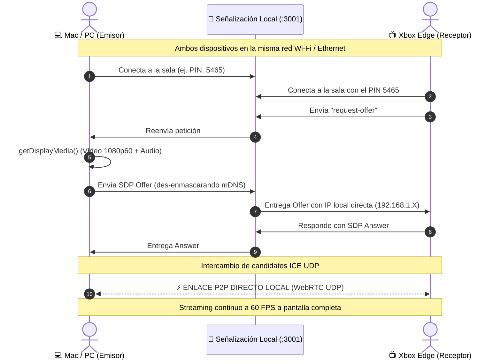

# 🎮 Xbox Cast — WebRTC Screen Mirroring

<div align="center">


**Transmite la pantalla y audio de tu Mac o PC directamente a tu consola Xbox en tu red local con latencia ultra-baja (&lt;50ms), a 1080p 60 FPS y sin necesidad de apps de pago ni servidores externos.**

[Características](#-características) • [Cómo Funciona](#-cómo-funciona) • [Inicio Rápido](#-inicio-rápido) • [Solución de Problemas](#-solución-de-problemas-y-tips) • [Arquitectura](#-arquitectura-técnica)

</div>

---

## 💡 ¿Qué es Xbox Cast?

**Xbox Cast** es una Aplicación Web Progresiva (PWA) de alto rendimiento diseñada específicamente para el navegador **Microsoft Edge en consolas Xbox** (Series X, Series S y Xbox One).

Permite duplicar la pantalla completa de tu ordenador, una ventana de aplicación o una pestaña concreta del navegador con audio estéreo sincronizado, conectándose **directamente de dispositivo a dispositivo (Peer-to-Peer) a través de la red Wi-Fi o Ethernet de tu casa**.

Al utilizar WebRTC nativo sobre UDP local:
- 🚫 **Cero intermediarios:** El flujo de vídeo y audio **nunca** viaja a servidores en la nube ni consume ancho de banda de internet.
- ⚡ **Latencia imperceptible:** Retardo sub-100ms (típicamente 20-40ms en Wi-Fi 5/6 o cable), ideal para ver contenido multimedia, streaming o presentaciones.
- 📺 **Experiencia 10-foot UI:** Interfaz diseñada específicamente para mando de consola (D-Pad y botón A), márgenes de sobreescaneo (*overscan safe areas*) para TVs y pantalla completa automática.

---

## ✨ Características

- 🎯 **Streaming 1080p @ 60 FPS:** Selección dinámica de calidad (1080p/720p y 60fps/30fps).
- 🔊 **Transmisión de Audio Estéreo:** Soporte completo de audio del sistema o de la pestaña transmitida (YouTube, Twitch, reproductores, etc.).
- 🕹️ **Diseño Optimizado para Mandos de Consola:**
  - Teclado virtual numérico en pantalla navegable con D-Pad.
  - Casillas de PIN de 4 dígitos grandes y legibles desde el sofá.
  - Detección de foco de alta visibilidad (`#107C10`).
  - HUD de controles auto-ocultable tras 3 segundos de inactividad.
- 🛡️ **Des-enmascarado Inteligente de mDNS:** Resuelve automáticamente el problema de privacidad de Chromium (que oculta IPs locales como `.local`), inyectando las IPs reales de la red local para que la Xbox pueda conectar de inmediato.
- 📊 **Panel de Diagnóstico en Vivo:** Telemetría en tiempo real tanto en la pantalla como en la consola del servidor (estados de conexión, ICE, candidatos LAN vs WAN y FPS).
- 🔌 **Cero Cuentas ni Dependencias Externas:** Servidor de señalización WebSocket ultraligero integrado en Node.js para funcionar 100% offline en tu hogar.
- ☁️ **Preparado para la Nube (Opcional):** Arquitectura desacoplada lista para desplegar en Vercel con Supabase Realtime si se desea emitir fuera de casa.

---

## 🛠️ Cómo Funciona



---

## 🚀 Inicio Rápido

### Requisitos Previos
- **Node.js** v18+ instalado en tu Mac/PC.
- **pnpm** (recomendado para ahorrar espacio en disco) o `npm`.
- Tu ordenador y tu Xbox conectados al **mismo router** (Wi-Fi o cable Ethernet).

### 1. Clonar el repositorio e instalar dependencias
```bash
git clone https://github.com/Alexgmatosc/xbox-cast.git
cd xbox-cast
pnpm install
```

### 2. Iniciar el servidor
```bash
pnpm run dev
```
*Este comando arrancará tanto la aplicación Next.js (puerto `3000`) como el servidor de señalización local (puerto `3001`).*

Verás un mensaje en la terminal con la dirección IP local detectada:
```bash
=======================================================
📡 Servidor de señalización WebRTC activo en puerto 3001
🏠 IP Primaria del Mac para WebRTC LAN: 192.168.1.10
📱 Direcciones IP locales detectadas:
   ➡️  http://192.168.1.10:3000/tv (Abre esto en Edge de Xbox)
=======================================================
```

### 3. En tu Mac / PC (Emisor)
1. Abre tu navegador (Google Chrome, Brave o Microsoft Edge recomendados) en:  
   👉 **`http://localhost:3000/cast`**
2. Verás en pantalla un **código PIN de 4 dígitos** (por ejemplo: `5465`).
3. Haz clic en **"Iniciar Transmisión"** y selecciona:
   - Una **pestaña del navegador** (ideal para vídeos con audio).
   - Una **ventana** concreta.
   - O la **pantalla completa**.
   *(Asegúrate de marcar la casilla de "Compartir audio" en el selector).*

### 4. En tu Xbox (Receptor)
1. Abre la aplicación **Microsoft Edge** en tu consola Xbox.
2. Introduce la dirección de tu ordenador con el puerto `:3000`:  
   👉 **`http://192.168.1.XX:3000/tv`** *(sustituye por la IP de tu Mac)*.
3. Introduce el PIN de 4 dígitos con el mando y pulsa **"Conectar y Ver"**.
4. ¡Listo! La pantalla se duplicará de inmediato a pantalla completa.

---

## 🧩 Solución de Problemas y Tips

### 1. Error 404 en la Xbox
- Asegúrate de incluir el puerto **`:3000`** en la barra de direcciones de Edge:  
  ✅ `http://192.168.1.XX:3000/tv`  
  ❌ `http://192.168.1.XX/tv` *(sin el :3000 irá al puerto 80 por defecto y dará 404)*.

### 2. Tienes una VPN activa en el ordenador
- Si tienes una aplicación de VPN abierta en tu Mac/PC (Wireguard, Tailscale, NordVPN, ProtonVPN, etc.):
  - Comprueba que tenga activada la opción **"Permitir tráfico de red local / Allow LAN traffic"**.
  - O desactiva la VPN temporalmente mientras transmites, ya que algunas VPNs bloquean que los navegadores envíen paquetes UDP locales entre dispositivos de la casa.

### 3. Audio en macOS
- macOS restringe la captura de audio en Safari. Para transmitir vídeo **con audio del sistema o de la pestaña**, utiliza **Google Chrome**, **Brave** o **Microsoft Edge**.

---

## 🏗️ Arquitectura Técnica

```
xbox-cast/
├── app/
│   ├── api/ip/route.ts         # Endpoint de autodetección de IP LAN del host
│   ├── cast/page.tsx           # Panel del emisor (Mac/PC): captura, PIN, preview y controles
│   ├── tv/page.tsx             # Visor TV (Xbox): 10-foot UI, entrada PIN con mando y fullscreen
│   ├── layout.tsx              # Shell base, fuentes y metadatos PWA
│   ├── page.tsx                # Selector inicial de rol (Emitir o Ver en TV)
│   └── globals.css             # Estilos TV, foco accesible y prevención de sobreescaneo
├── components/
│   ├── VideoPlayer.tsx         # Reproductor WebRTC con HUD auto-ocultable y controles
│   ├── PinInput.tsx            # Teclado en pantalla y casillas accesibles para D-Pad
│   ├── ConnectionBadge.tsx     # Métricas en tiempo real (estado, FPS, latencia estimada)
│   ├── DebugPanel.tsx          # Panel desplegable con registro de eventos y telemetría
│   └── TVSafeLayout.tsx        # Contenedor con márgenes de seguridad para televisores
├── hooks/
│   └── useWebRTC.ts            # Ciclo de vida WebRTC (mutex atómico, candidatos ICE y reconexión)
├── lib/
│   ├── codecs.ts               # Utilidades de negociación de códecs
│   └── signaling/
│       ├── local-ws.ts         # Cliente WebSocket para desarrollo en red local
│       ├── supabase.ts         # Adaptador Supabase Realtime (para producción opcional)
│       └── types.ts            # Tipado estricto de eventos de señalización y telemetría
├── server/
│   └── signaling.mjs           # Servidor WebSocket local ultraligero con unmasking mDNS
└── store/
    └── useCastStore.ts         # Estado global ligero con Zustand
```

---

## 📄 Licencia

Este proyecto está bajo la licencia [MIT](LICENSE). Puedes utilizarlo, modificarlo y compartirlo libremente.
